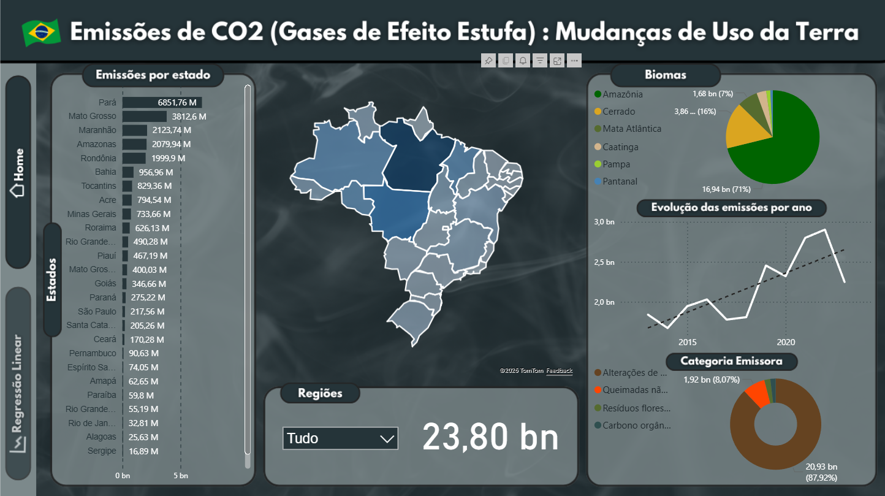

# 📊 Trabalho Avaliativo - UC de Análise de Dados  

## 📌 Descrição do Projeto  
Este projeto foi desenvolvido no último semestre, em grupo, como parte da disciplina de **Análise de Dados**. O objetivo foi a criação de uma **Dashboard no Power BI** para analisar informações relacionadas aos **gases do efeito estufa**, com foco em **mudanças de uso da terra**.  

A proposta foi utilizar dados reais e tratá-los de forma que fosse possível extrair insights relevantes, possibilitando uma análise visual clara e objetiva sobre o tema.  

---

## 📂 Base de Dados  
- **Fonte:** SEEG (Sistema de Estimativas de Emissões de Gases de Efeito Estufa)  
- **Período analisado:** 2013 a 2023  
- **Filtros aplicados:**  
  - Estado  
  - Região  
  - Biomas  
  - Categorias emissoras  

Além da análise descritiva, também foi realizada uma **análise preditiva** com projeção para os **próximos 10 anos**.  

---

## 🛠️ Ferramentas Utilizadas  
- **Power BI** → Construção da Dashboard  
- **Excel** → Apoio no tratamento da base de dados  

O curso de **Power BI (Senai - São Paulo)** foi fundamental para a aplicação prática dos conceitos aprendidos, permitindo maior autonomia na criação de indicadores e visualizações.  

---

## 📈 Resultados  
A Dashboard permite:  
- Visualização clara das emissões de gases de efeito estufa por diferentes dimensões (estado, região, biomas etc.)  
- Análise temporal das emissões no período de 2013 a 2023  
- Previsão de tendências para os próximos 10 anos  
- Filtros dinâmicos para aprofundamento das análises  

---

## 🔗 Link da Dashboard  
👉 [Acesse aqui a Dashboard no Power BI](https://lnkd.in/dhNKS7WK)  

---

## 👥 Equipe  
Projeto desenvolvido em grupo como parte do trabalho avaliativo da UC de Análise de Dados.  

<table>
  <tr>
    <td align="center">
      <a href="https://github.com/julliakathelyn">
        
         
        <b> :octocat: Jullia Kathelyn</b>
      </a>
       
       
      <a href="https://www.linkedin.com/in/jullia-kathelyn/">🔗 LinkedIn</a>
    </td>
    <td align="center">
      <a href="https://github.com/kauassilva">
        
         
        <b>:octocat: Kauã Silva</b>
      </a>
       
       
      <a href="https://www.linkedin.com/in/kaua-santos">🔗 LinkedIn</a>
    </td>
    <td align="center">
      <a href="https://github.com/AmandaMeneghini">
        
         
        <b>:octocat: Amanda Meneghini</b>
      </a>
       
       
      <a href="https://www.linkedin.com/in/amanda-meneghini">🔗 LinkedIn</a>
    </td>
  </tr>
  <tr>
    <table/>
